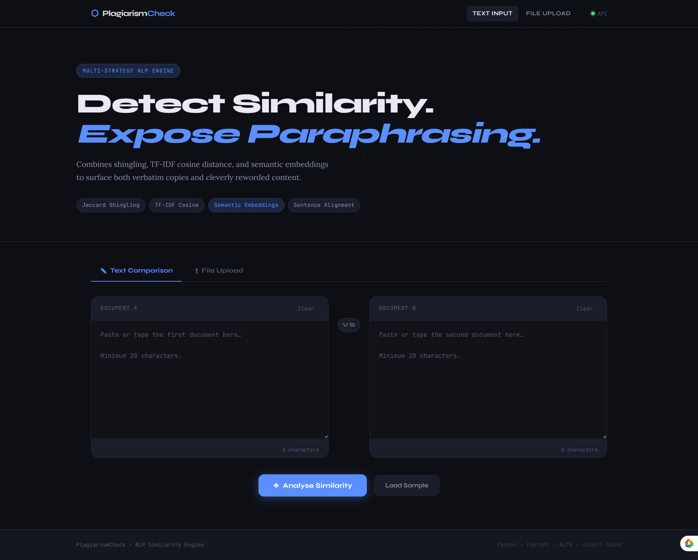

# ⬡ PlagiarismCheck — AI-Powered Similarity Detection Engine

> Detect verbatim copying **and** intelligent paraphrasing using a hybrid NLP pipeline combining statistical and semantic techniques.

---

# UI Preview



---

## Live Demo

**Try the app here:** [https://utsav-kumar-link.render.app](https://plagiarism-checker-j9bs.onrender.com)

---

# Overview

PlagiarismCheck is a **full-stack AI-powered plagiarism detection system** that goes beyond basic keyword matching.

It combines:

* Statistical similarity (Jaccard + TF-IDF).
* Semantic understanding (transformer embeddings).
* Sentence-level alignment.

---

# Features

* Detects **exact copy-paste**
* Detects **paraphrased content**
* Supports `.txt`, `.pdf`, `.docx`
* OCR support (Tesseract + Google Vision)
* Sentence-level matching
* Clean interactive UI (no frameworks)

---

# Architecture

```
Frontend (HTML/CSS/JS)
        ↓
 FastAPI Backend
        ↓
 Text Extraction → NLP Processing → Similarity Engine
        ↓
  Jaccard + TF-IDF + Semantic
```

---

# Tech Stack

### Backend

* FastAPI
* NLTK
* scikit-learn
* sentence-transformers
* pdfplumber
* pytesseract

### Frontend

* HTML5
* CSS3
* Vanilla JavaScript

---

# Project Structure

```
backend/
frontend/
tests/
docs/
requirements.txt
```

---

# Quick Start

## 1. Clone repo

```bash
git clone https://github.com/your-username/plagiarism-checker.git
cd plagiarism-checker
```

## 2. Setup environment

```bash
python -m venv venv
venv\Scripts\activate   # Windows
```

## 3. Install dependencies

```bash
pip install -r requirements.txt
```

## 4. Run server

```bash
uvicorn backend.main:app --reload
```

## 5. Open app

```
http://localhost:8000
```

---

# API Endpoints

### Health

```
GET /api/health
```

### Compare Text

```
POST /api/check-plagiarism
```

### Compare Files

```
POST /api/check-files
```

---

# How It Works

### 1. Preprocessing

* Tokenization
* Lemmatization
* Stopword removal

### 2. Similarity Methods

| Method   | Purpose               |
| -------- | --------------------- |
| Jaccard  | Exact similarity      |
| TF-IDF   | Vocabulary similarity |
| Semantic | Meaning similarity    |

### 3. Final Score

```
Final Score = Weighted combination of all methods
```

---

# Example Output

```json
{
  "similarity_percent": 61.3,
  "confidence": "medium",
  "methods": ["tfidf", "semantic"]
}
```

---

# Testing

```bash
pytest tests/ -v
```

---

# Environment Variables

```env
GOOGLE_CREDENTIALS_PATH=your_path
TESSERACT_PATH=your_path
```

---

# Roadmap

* [ ] Multi-document comparison
* [ ] PDF export report
* [ ] API authentication
* [ ] Cloud storage integration

---

# Why This Project Matters

This is **not a basic CRUD app** — it demonstrates:

* NLP pipeline design
* ML model integration
* Full-stack architecture
* Real-world problem solving

---
